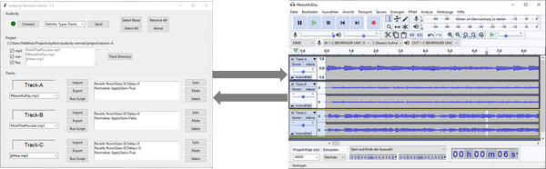

***
# Audacity-Remote

***

[**Audacity**](https://www.audacityteam.org) is an easy-to-use, multi-track audio editor and recorder for Windows, macOS, GNU/Linux and other operating systems. Audacity is open source software licensed under GPL, version 2 or later. 

**Audacity-Remote** connects to Audacity via built-in bidirectional *named pipes*. The idea is to have a tool, that supports automated workflows in selected usage scenarios. It is not intended to and can not replace the GUI in general. For the letter it would be necessary that the pipe interface is not limited due to its architectural design. As of today, you can simply send commands and query data in a different step. But state state changes within Audacity will not be pushed back and synchronized to the connected pipe interface.   

The pipe interface could be used with any programming language. By using a scripting language like Python it is flexible and usage of tkinter lib even allows graphical user interfaces to be easily built. Audacity already comes with a basic *pipeclient*.py implementation, that allow send any command to Audacity manually from CLI. This has been modified and rewritten for the needs of communication with the graphical UI.

The following workflows have been identified and verified by personal usage.
- **Multitrack Editing**   
    If you are a musician and have multitrack audio files of last jamsession or rehearsal, you most probably need to import those audiofiles for a final mixdown. You import one track for each musician and always apply same chain of individual effects for each instrument before running a global export of audio. You repeat the scenario for different songs that have been collected in separate directories.
- **Effect chain optimization**   
    You have one audio file and like to easily check a number of variants of your effect chain on same audio file until you find the right combination for reproducible results. So you import same audio file multiple times, and apply different effect chains on each track and easily switch between those for comparison.

## Getting Started

The usage of Audacity-Remote is quite simple. You only need a working Python 3.7 installation in your operating system and copy just 2 files, which only need to be placed in same directoy.
- audacity-remote.py,  this is the APP
- pipeclient2.py, this is client for the AUDACITY pipe interface that is instantiated in the APP

Other files like audiofiles and a configuration file of the project can be put anywhere. A structure like the one in this repository is recommended.
You are not restricted when to start Audacity-Remote, as you can connect again if you start Audacity later.

You start the program or place a link into your OS. You an start with or without a configuration file for your project. The project configuration file defines track names, default audio filenames and the list effects in the chain for each track. The configuraton is defines as a *.json file. An example configuraion is can be found in the repository   

    $ pythonw <path>/audacity-remote.pyw
              or
    $ pythonw <path>/audacity-remote.pyw <path-to-cfg>/project.cfg
    
The list of commands that are supported by Audacity can be found in the [Audacity Scripting reference](https://manual.audacityteam.org/man/scripting_reference.html).   

## Manual - UI description

The interface of the UI is split in 3 functional areas, each having its own scope
- **Audacity**   
  - Connect to Audacity
  - Send a command from a list, here you can also modify the command before sending it 
  - Run Preset commands 
- **Project**   
  - Select a directory for your audio files, this is synced instantly to each tracks file selection dropdown
  - Filter Audio filetypes to be listed
- **Tracks** (default or configured by commandline parameter)   
  - assign an audio file to a track
  - Import and Export of Audiofile to/from Audacity
  - Apply effect chain or single effect by doubleclick on an item
  - Solo, Mute or Select Track 

## Limitations

- The Audacity pipe interface seem to not allow importing of files in case that the full path includes whitespaces
- The architecture of the pipe interface of Audacity is limited for automation. You can send commands for control or query of data but **Audacity-Remote** will never be synchronized when you switch states in Audacity UI, e.g. change Solo, Mute, Selection etc. Technically, the pipe interface is not designed internally as a message bus supporting a publish/subscribe design pattern. For automation you would need to support independent producer/consumer, which would synchronize states to all participants.
 
## ToDo, Ideas, ....

- current version is 0.9 , 90% functional ready
- make the effect chain flexible by moving items up/down to change the order
- make project change more flexible from the UI
- code clean up and refactor is always a good idea :-)
- documenation
- currently only tested on Windows with Audacity 2.4.2
***
*Thanks to my friends who supported me with the idea to work on this project.   
 **This software is free** - You can use it as is or modify it acc. to your needs. If you like it, you're welcome to support and honor the work that takes you steps ahead of starting from scratch by making a donation  
 *   
***
 
